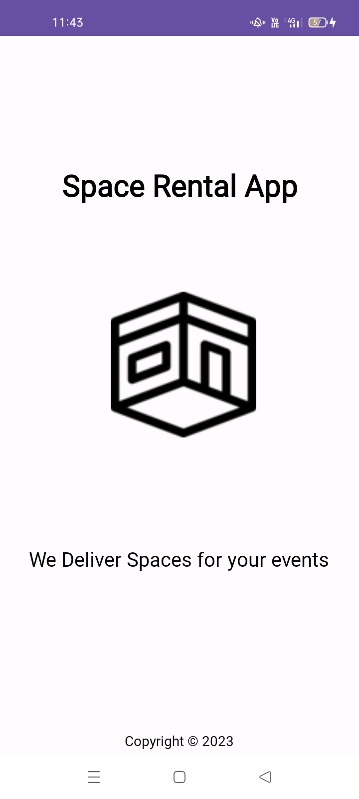

# Space Rental App

Welcome to the Space Rental App! This README file will guide you through the setup and usage of the app.

## Introduction

The Space Rental App is a mobile application developed using Android Studio and Kotlin. It allows users to browse and rent spaces for various events or purposes. The app uses Firebase for real-time database and authentication.

## Features

- User authentication (sign up, sign in, and sign out)
- Browse available spaces
- Rent spaces and manage bookings
- Real-time updates with Firebase

## Prerequisites

- Android Studio installed on your machine
- A Firebase project set up with Firestore and Authentication enabled
- Kotlin configured in Android Studio

